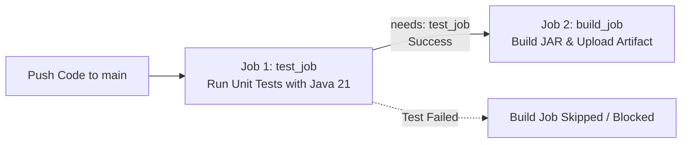

# Bài tập 3: Thiết lập luồng CI tuần tự xử lý Job Isolation (QuickBite - Payment Service)

## 1. Mục tiêu bài tập
- **Luồng công việc tuần tự (*Sequential Workflow*):** Sử dụng từ khóa `needs` để thiết lập mối quan hệ phụ thuộc giữa các job trong GitHub Actions.
- **Hiểu sâu về Job Isolation (Tính cô lập giữa các Job):** Nắm vững bản chất rằng mỗi job trong GitHub Actions được cấp phát trên một máy ảo độc lập (*Ephemeral Runner*), không tự động kế thừa mã nguồn, file hệ thống hay môi trường runtime của job trước.
- **Xây dựng quy trình Quality Gate thực tế:** Đảm bảo toàn bộ Unit Test phải vượt qua (Pass) trước khi ứng dụng được biên dịch và đóng gói thành file JAR.

---

## 2. Bối cảnh và Yêu cầu nghiệp vụ
Service `payment-service` của hệ thống **QuickBite** quản lý dòng tiền và các giao dịch thanh toán nhạy cảm. Pipeline CI được yêu cầu chia làm 2 giai đoạn:



1. **Giai đoạn 1 (`test_job`):** Chạy toàn bộ Unit Test trên Java 21.
2. **Giai đoạn 2 (`build_job`):** Chỉ được kích hoạt khi Giai đoạn 1 thành công. Job này thực hiện build file JAR và lưu lại artifact.

---

## 3. Bản chất kỹ thuật của Job Isolation trong GitHub Actions

Nhiều lập trình viên khi mới tiếp cận CI/CD thường mắc lỗi giả định rằng: *"Job 1 đã checkout code và cài Java rồi thì Job 2 chỉ cần gọi lệnh build"*. Đây là nhận thức sai lầm vì cơ chế **Job Isolation**:

| Đặc điểm | Cơ chế hoạt động của GitHub Actions | Tác động tới Job 2 (`build_job`) |
| :--- | :--- | :--- |
| **Môi trường máy ảo** | Mỗi job được thực thi trên một máy ảo Ubuntu mới tinh (*Fresh Ephemeral VM*), hoàn toàn tách biệt. | Job 2 **KHÔNG** chia sẻ filesystem hay RAM với Job 1. |
| **Mã nguồn (Source Code)** | Mã nguồn được clone ở Job 1 sẽ bị hủy cùng với VM của Job 1 khi job kết thúc. | Job 2 **BẮT BUỘC** phải có bước `actions/checkout@v4`. |
| **Môi trường Runtime (Java)** | Cấu hình Java ở Job 1 chỉ tồn tại trong phiên của Job 1. | Job 2 **BẮT BUỘC** phải có bước `actions/setup-java@v4` (Java 21). |
| **Quyền thực thi file** | Filesystem mới chưa lưu trạng thái quyền file của job trước. | Job 2 **BẮT BUỘC** phải có bước `chmod +x gradlew`. |

---

## 4. Vai trò của từ khóa `needs`

- **Mặc định:** Tất cả các job khai báo dưới `jobs:` trong GitHub Actions sẽ chạy **song song (parallel)** để tiết kiệm thời gian.
- **Khi sử dụng `needs: [job_name]`:**
  - GitHub Actions thiết lập ràng buộc tuần tự: Job B chỉ chạy khi Job A hoàn thành với trạng thái `success`.
  - Nếu Job A thất bại (`failure`), Job B sẽ tự động chuyển sang trạng thái `skipped` (bị bỏ qua), ngăn chặn việc đóng gói sản phẩm lỗi.

---

## 5. File cấu hình hoàn chỉnh

### A. Cấu hình cho Repository độc lập (`session_07/exercise_03/ci.yml`)

```yaml
name: Payment Service CI

on:
  push:
    branches:
      - main

jobs:
  # Giai đoạn 1: Chạy Unit Test
  test_job:
    name: Run Unit Tests
    runs-on: ubuntu-latest
    steps:
      - name: Checkout Source Code
        uses: actions/checkout@v4

      - name: Setup Java JDK 21
        uses: actions/setup-java@v4
        with:
          java-version: '21'
          distribution: 'temurin'
          cache: 'gradle'

      - name: Grant execute permission for gradlew
        run: chmod +x gradlew

      - name: Run Unit Tests
        run: ./gradlew test

  # Giai đoạn 2: Build JAR (phụ thuộc vào test_job qua từ khóa needs)
  build_job:
    name: Build & Package JAR
    needs: test_job
    runs-on: ubuntu-latest
    steps:
      # Job Isolation: Bắt buộc checkout lại mã nguồn
      - name: Checkout Source Code
        uses: actions/checkout@v4

      # Job Isolation: Bắt buộc cài đặt lại Java JDK 21
      - name: Setup Java JDK 21
        uses: actions/setup-java@v4
        with:
          java-version: '21'
          distribution: 'temurin'
          cache: 'gradle'

      # Cấp quyền thực thi và build JAR
      - name: Grant execute permission for gradlew
        run: chmod +x gradlew

      - name: Build JAR Package
        run: ./gradlew bootJar -x test

      # Lưu trữ file JAR đầu ra làm Artifact
      - name: Upload Build Artifact
        uses: actions/upload-artifact@v4
        with:
          name: payment-service-artifact
          path: build/libs/*.jar
          retention-days: 3
```

### B. Cấu hình chạy trên Monorepo (`.github/workflows/payment-service-ci.yml`)

```yaml
name: Payment Service CI

on:
  push:
    branches:
      - main
  pull_request:
    branches:
      - main
  workflow_dispatch:

jobs:
  test_job:
    name: Run Unit Tests
    runs-on: ubuntu-latest

    defaults:
      run:
        working-directory: session_07/exercise_03

    steps:
      - name: Checkout Source Code
        uses: actions/checkout@v4

      - name: Setup Java JDK 21
        uses: actions/setup-java@v4
        with:
          java-version: '21'
          distribution: 'temurin'
          cache: 'gradle'

      - name: Grant execute permission for gradlew
        run: chmod +x gradlew

      - name: Run Unit Tests
        run: ./gradlew test --no-daemon

  build_job:
    name: Build & Package JAR
    needs: test_job
    runs-on: ubuntu-latest

    defaults:
      run:
        working-directory: session_07/exercise_03

    steps:
      - name: Checkout Source Code
        uses: actions/checkout@v4

      - name: Setup Java JDK 21
        uses: actions/setup-java@v4
        with:
          java-version: '21'
          distribution: 'temurin'
          cache: 'gradle'

      - name: Grant execute permission for gradlew
        run: chmod +x gradlew

      - name: Build JAR Package
        run: ./gradlew bootJar -x test --no-daemon

      - name: Upload Build Artifact
        uses: actions/upload-artifact@v4
        with:
          name: payment-service-artifact
          path: session_07/exercise_03/build/libs/*.jar
          retention-days: 3
```

---

## 6. Hướng dẫn kiểm thử và nộp bài

### Bước 1: Kiểm thử Unit Test và Build trên máy local
```bash
cd session_07/exercise_03

# Chạy Unit Test
./gradlew test

# Build file JAR
./gradlew bootJar
```
*(Trên Windows PowerShell: `.\gradlew.bat test` và `.\gradlew.bat bootJar`)*

### Bước 2: Commit và Push lên GitHub
```bash
git add .
git commit -m "ss7 ex3"
git push origin main
```

### Bước 3: Xác minh trên tab Actions của GitHub
1. Truy cập: `https://github.com/Khac-Hai/Devops/actions`.
2. Mở workflow **Payment Service CI**.
3. Bạn sẽ thấy sơ đồ luồng chạy tuần tự gồm 2 ô liên kết:
   - `Run Unit Tests` (xanh ✅) ➔ Mũi tên trỏ tới ➔ `Build & Package JAR` (xanh ✅).
4. Ở cuối trang Summary, phần **Artifacts** xuất hiện gói `payment-service-artifact` sẵn sàng tải về.
5. Copy link của workflow run này dán vào Portal để nộp bài.
