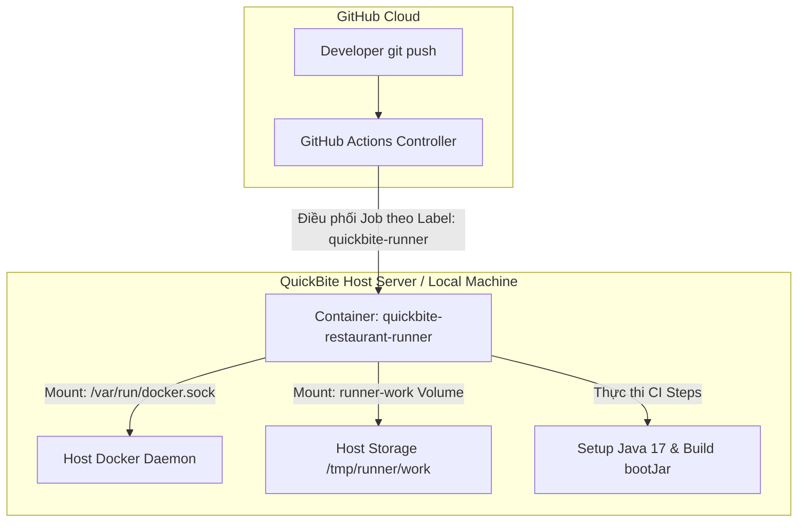

# Bài tập 4: Triển khai Pipeline CI với Self-Hosted Runner (QuickBite - Restaurant Service)

## 1. Mục tiêu bài tập
- **Triển khai Self-hosted Runner:** Tự thiết lập hạ tầng GitHub Actions Runner độc lập sử dụng Docker Compose trên môi trường máy chủ nội bộ.
- **Hiểu cơ chế Docker Socket Mounting (DooD):** Nắm vững lý do và cách mount `/var/run/docker.sock` từ host vào container runner để thực thi các lệnh Docker.
- **Cơ chế định tuyến với Labels:** Vận dụng hệ thống nhãn (*labels*) để chỉ định chính xác workflow chạy trên Self-hosted runner thông qua cú pháp `runs-on`.

---

## 2. Bối cảnh và Kiến trúc triển khai

Công ty **QuickBite** đầu tư server riêng làm **Self-hosted runner** cho service `restaurant-service` nhằm tối ưu tốc độ build, tận dụng phần cứng chuyên biệt và lưu trữ cache cục bộ.



---

## 3. Phân tích Kỹ thuật & Cấu hình Docker Compose

### 🟢 1. Vì sao cần mount Docker Socket (`/var/run/docker.sock`)?
- **Bản chất:** Container runner mặc định không có Docker Daemon chạy bên trong.
- **Giải pháp (Docker-outside-of-Docker / DooD):** Khi mount file Unix socket `/var/run/docker.sock` từ máy host vào bên trong container, tiến trình runner có thể giao tiếp trực tiếp với Docker Engine của máy host. Điều này cho phép job CI có thể chạy các lệnh như `docker build`, `docker-compose`, hoặc chạy các Action dạng container.

### 🟢 2. Vì sao cần mount Volume cho thư mục làm việc (`runner-work`)?
- Runner cần một không gian đĩa để clone source code, tải dependencies Gradle, lưu trữ file tạm trong quá trình biên dịch.
- Việc mount volume `runner-work:/tmp/runner/work` giúp tránh tràn dung lượng lớp ghi của container (*container writable layer*), đồng thời tái sử dụng được dữ liệu đệm giữa các lần build.

### 🟢 3. Danh sách biến môi trường trong `docker-compose.yml`:
- `REPO_URL`: URL của GitHub Repository (ví dụ: `https://github.com/Khac-Hai/Devops`).
- `RUNNER_TOKEN`: Registration token được sinh từ GitHub để xác thực và liên kết runner với repo.
- `RUNNER_NAME`: Tên hiển thị định danh cho runner (ví dụ: `quickbite-restaurant-runner`).
- `RUNNER_LABELS`: Nhãn tùy chỉnh được gán cho runner (ví dụ: `quickbite-runner,restaurant-service,linux,x64`).
- `RUNNER_WORKDIR`: Thư mục làm việc bên trong container (`/tmp/runner/work`).

---

## 4. File cấu hình hoàn chỉnh

### A. File `docker-compose.yml` (`session_07/exercise_04/docker-compose.yml`)

```yaml
version: '3.8'

services:
  quickbite-self-hosted-runner:
    image: myoung34/github-runner:latest
    container_name: quickbite-restaurant-runner
    restart: unless-stopped
    environment:
      - REPO_URL=${REPO_URL:-https://github.com/Khac-Hai/Devops}
      - RUNNER_TOKEN=${RUNNER_TOKEN}
      - RUNNER_NAME=${RUNNER_NAME:-quickbite-restaurant-runner}
      - RUNNER_LABELS=${RUNNER_LABELS:-quickbite-runner,restaurant-service,linux,x64}
      - RUNNER_WORKDIR=/tmp/runner/work
      - DISABLE_AUTO_UPDATE=true
    volumes:
      - /var/run/docker.sock:/var/run/docker.sock
      - runner-work:/tmp/runner/work

volumes:
  runner-work:
    name: quickbite-runner-work
```

### B. File `ci.yml` (`session_07/exercise_04/ci.yml`)

```yaml
name: Restaurant Service CI

on:
  push:
    branches:
      - main

jobs:
  build:
    name: Build Restaurant Service on Self-Hosted Runner
    # Chỉ định chạy trên self-hosted runner với nhãn quickbite-runner
    runs-on: [self-hosted, quickbite-runner]

    steps:
      - name: Checkout Source Code
        uses: actions/checkout@v4

      - name: Setup Java JDK 17
        uses: actions/setup-java@v4
        with:
          java-version: '17'
          distribution: 'temurin'
          cache: 'gradle'

      - name: Grant execute permission for gradlew
        run: chmod +x gradlew

      - name: Build with Gradle
        run: ./gradlew bootJar --no-daemon

      - name: Upload Build Artifact
        uses: actions/upload-artifact@v4
        with:
          name: restaurant-service-artifact
          path: build/libs/*.jar
          retention-days: 3
```

---

## 5. Hướng dẫn từng bước kích hoạt Self-Hosted Runner & Chạy Pipeline

### Bước 1: Lấy Runner Registration Token từ GitHub
1. Mở Repository trên trình duyệt: `https://github.com/Khac-Hai/Devops`.
2. Vào **Settings** ➔ **Actions** ➔ **Runners** (thanh menu bên trái).
3. Nhấp nút **New self-hosted runner**.
4. Trong phần hướng dẫn tải về, sao chép chuỗi mã Token nằm sau tham số `--token` (ví dụ: `AQ5XXXXX...`).

### Bước 2: Cấu hình file `.env`
Trong thư mục `session_07/exercise_04/`, tạo file `.env` từ `.env.example`:
```env
REPO_URL=https://github.com/Khac-Hai/Devops
RUNNER_TOKEN=<DÁN_TOKEN_VỪA_LẤY_VÀO_ĐÂY>
RUNNER_NAME=quickbite-restaurant-runner
RUNNER_LABELS=quickbite-runner,restaurant-service,linux,x64
```

### Bước 3: Khởi chạy container Self-Hosted Runner
```bash
cd session_07/exercise_04
docker compose up -d
```

Kiểm tra log xem runner đã kết nối thành công:
```bash
docker logs -f quickbite-restaurant-runner
```
*Kết quả hiển thị:* `Listening for Jobs` hoặc `Runner successfully connected to GitHub`.

### Bước 4: Kiểm tra trạng thái trên GitHub
Quay lại trang **Settings > Actions > Runners** trên GitHub, bạn sẽ thấy `quickbite-restaurant-runner` xuất hiện với trạng thái **🟢 Idle** và danh sách nhãn: `self-hosted`, `quickbite-runner`, `restaurant-service`, `linux`, `x64`.

### Bước 5: Push code và Kiểm chứng kết quả
```bash
git add .
git commit -m "ss7 ex4"
git push origin main
```

1. Mở tab **Actions** trên GitHub, chọn workflow **Restaurant Service CI**.
2. Mở chi tiết job **Build Restaurant Service on Self-Hosted Runner**.
3. Trong phần log mở đầu `Set up job`, kiểm tra thông tin runner:
   ```text
   Runner name: 'quickbite-restaurant-runner'
   Machine name: 'quickbite-restaurant-runner'
   ```
4. Job hoàn tất thành công và upload artifact `restaurant-service-artifact`.
5. Copy link workflow run thành công để nộp bài trên Portal.
